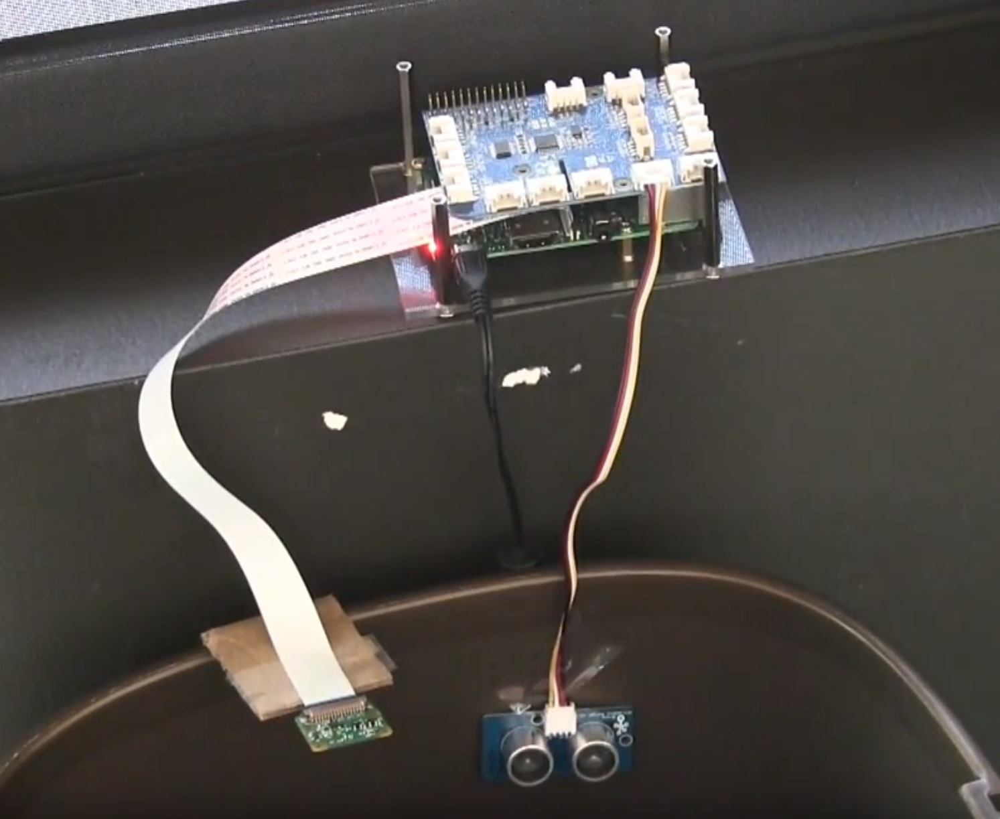
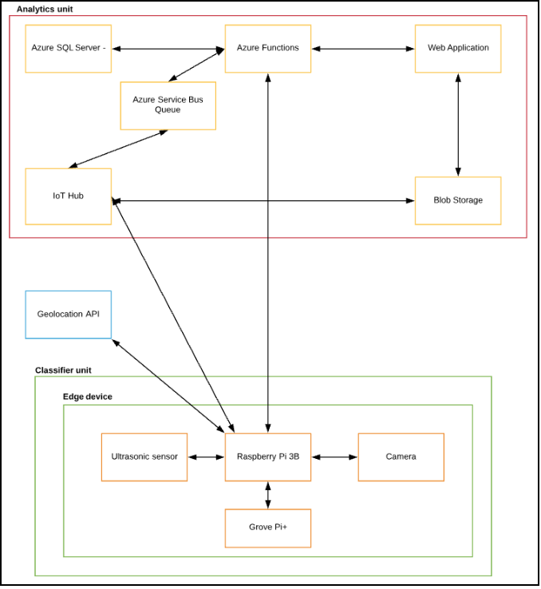

# **RECYCLE.IO**

Welcome to the home of Recycle.io

This tutorial shows how to setup Recycle.io system. It includes Edge modules source code and deployment template.
 
 

## How to setup edge modules on (Raspbian) RaspberryPi
### Prerequisites
  1. Create an IoT Hub.
	2. Register an IoT Edge device to your IoT hub.
	3. Install and start the IoT Edge runtime on RaspberryPi
	2. Enable Camera and i2c on RaspberryPi
	3. Connect GrovePi to RaspberryPi GPIO
	4. Connect ultrasonic ranger sensor to Digital Pin 3
	5. Connect camera module to RaspberryPi
	6. Place/attach ultrasonic ranger and camera to the bin as shown below   
		
   

  ### Development/Deployment resources
1. Install [Visual Studio Code](https://code.visualstudio.com/download).
2. [Azure IoT Edge extension](https://marketplace.visualstudio.com/items?itemName=vsciot-vscode.azure-iot-edge) for Visual Studio Code.
3. Install [Docker CE](https://docs.docker.com/install/) on the device with Visual Studio Code.
4. Configure the Azure IoT Toolkit extension with the connection string for your IoT hub.
5. Download [deployment.json](https://github.com/MSAzureHackathon/recycle.io/blob/master/edge/config/deployement.json) file.
6. Update environment variables in the downloaded file.
	* Set IoTHubConnectionString env variable
	* Set IoTDeviceConnectionString env variable
7. Update desired properties:
	* binWidth - width of the trash bin (number)
	* binType - recycle or organic
8. In the Azure IoT Hub Devices explorer, right-click on registered Pi, and then select Create Deployment for IoT Edge device. Select the downloaded deployment.json file and then choose Select Edge Deployment Manifest.

   
  
  ## How to test the system

  After all the moduels start running on edge device, place some trash in the bin (System might not detect the event if trash is thrown very quickly). Prototype custom vision model is trained to detect cardboard, styrofoam, plastic bags, cfl and egg shell. If there is any violation, details will be updated in SQL database, which can be verified via web application. Click on the bin displayed on the maps and a link to last violation image is present at the bottom of the details page.
  ## Architectural diagram
   
  
  
